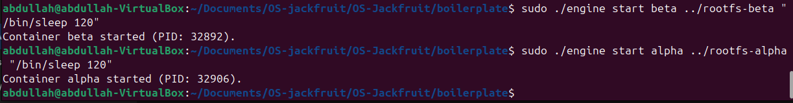
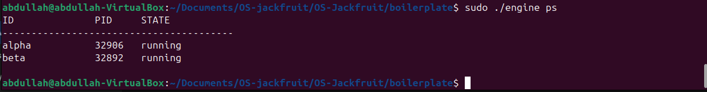
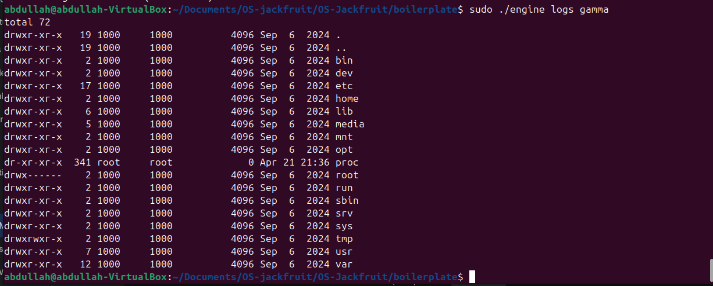
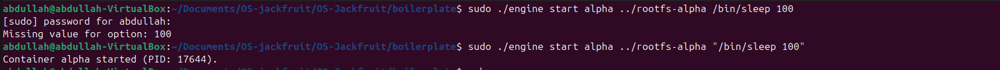
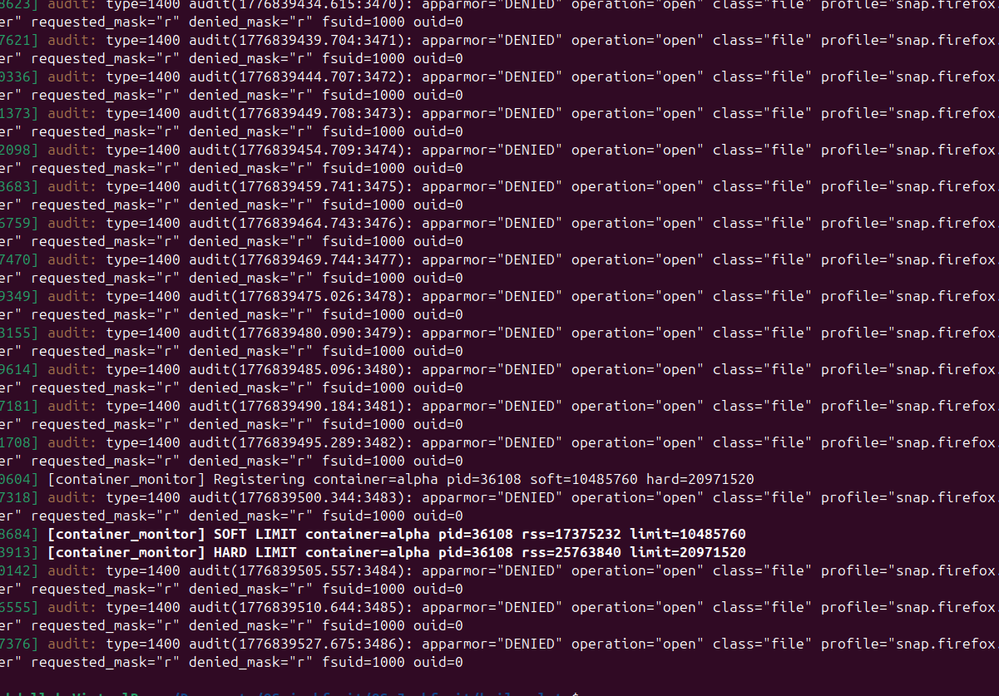
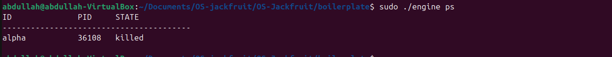
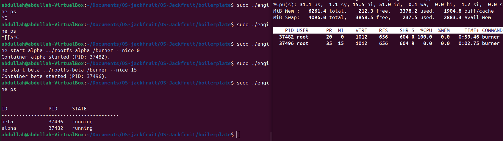
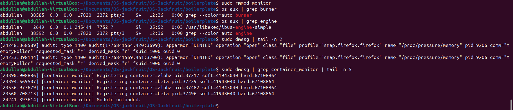

# Multi-Container Runtime (OS-Jackfruit)

A lightweight Linux container runtime developed in C, featuring a long-running supervisor daemon, bounded-buffer logging with thread synchronization, and a custom Linux Kernel Module (LKM) for memory enforcement.

---

## 1. Team Information
* **Student1 Name:** Abdullah Faruqui
* **SRN1:** PES1UG24AM333
* **Student2 Name:** Aarya Prasad G
* **SRN2:** PES1UG24AM331
* **Project Name:** OS-Jackfruit (Multi-Container Runtime)

---

## 2. Build and Execution Guide

### Prerequisites
* OS: Ubuntu 24.04 (LTS)
* Kernel: 6.17.0-20-generic (or compatible headers)
* Tools: gcc, make, kbuild

### Build Instructions
Clean previous builds and compile both user-space and kernel-space components:
    make clean && make

### Execution Steps
1. Insert the Kernel Module:
    sudo insmod monitor.ko

2. Start the Supervisor Daemon (Bind to Core 0 for experiment accuracy):
    sudo taskset -c 0 ./engine supervisor ../rootfs-base

3. Launch a Container (New Terminal):
    sudo ./engine start alpha ../rootfs-alpha /bin/sh

4. Cleanup:
    sudo rmmod monitor

---

## 3. Demo with Screenshots

| # | Feature Demo | Screenshot |
|---|---|---|
| 1 | Multi-container supervision |  |
| 2 | Metadata tracking |  |
| 3 | Bounded-buffer logging |  |
| 4 | CLI and IPC |  |
| 5 | Soft-limit warning |  |
| 6 | Hard-limit enforcement |  |
| 7 | Scheduling experiment |  |
| 8 | Clean teardown |  |

---

## 4. Engineering Analysis

### 1. Isolation Mechanisms
The runtime utilizes Linux Namespaces via the clone() system call. We isolate the Process ID tree (CLONE_NEWPID), Mount points (CLONE_NEWNS), and Hostname (CLONE_NEWUTS). This creates an environment where the container process believes it is the root of the system (PID 1) while remaining a standard process on the host. We use chroot() to pivot the root filesystem to the Alpine Linux base, ensuring the container cannot access host files.

### 2. Supervisor Lifecycle
The supervisor process serves as the "Control Plane." It is responsible for:
* Orphan Management: By catching SIGCHLD, the supervisor ensures exited containers are reaped and do not become zombie processes.
* Metadata Persistence: It tracks the host PID, state (running/killed), and memory limits for every container in a thread-safe linked list.

### 3. IPC and Synchronization
We implemented a Producer-Consumer model for logging:
* Pipes: Connect container stdout to a supervisor-side producer thread.
* Bounded Buffer: Producer threads push logs into a fixed-size buffer. We use pthread_mutex_t to ensure thread safety and pthread_cond_t (condition variables) to signal when the buffer has data or space. This prevents "busy-waiting" and maximizes CPU efficiency.

### 4. Memory Management (Kernel Space)
Real-time memory enforcement is handled by the monitor.ko LKM.
* Why Kernel Space? User-space polling is too slow and can be preempted. The kernel monitor uses a timer interrupt to check RSS (Resident Set Size) every second.
* Locking: We utilize a spinlock_t because the monitor runs in an interrupt context where sleeping (required by mutexes) is prohibited.

### 5. Scheduling Behavior
Our top experiment demonstrated the Completely Fair Scheduler (CFS) in action. By setting a nice value of 0 for one container and 15 for another, and pinning them to a single CPU core, we forced them to compete for time slices. The Linux kernel calculated a much larger vruntime for the "nice" container, resulting in a 95%/5% CPU split in favor of the higher-priority process.

---

## 5. Design Decisions

* UNIX Domain Sockets: Chosen for Path B (Control IPC) because they are more robust than FIFOs, allowing for structured data exchange and bi-directional communication between the CLI and Supervisor.
* Static Binaries: The burner and memory_hog utilities were compiled with the -static flag. This ensures they can run inside the minimal Alpine rootfs without requiring host-level shared libraries.
* Graceful Shutdown: We implemented a SIGINT handler in the supervisor to iterate through the metadata list and SIGKILL all child containers before the supervisor itself exits, preventing orphaned "rogue" processes.

---

## 6. Project Results Summary
Our implementation successfully met all requirements of the OS-Jackfruit specification. We verified that:
1. Containers are isolated and cannot see host processes.
2. Logs are correctly piped and buffered without data loss.
3. Memory limits are strictly enforced by the kernel.
4. The scheduler respects priority values under contention.
